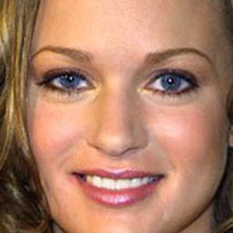

|   |  
|:-:|:-:|
| [Brian Dolhansky](http://briandolhansky.com) | [Cristian Canton Ferrer](https://cristiancanton.github.io/)

# Introduction

We introduce a novel approach to in-painting where the identity of the object to remove or change is preserved and accounted for at inference time: Exemplar GANs (ExGANs). ExGANs are a type of conditional GAN that utilize exemplar information to produce high-quality, personalized in-painting results. We propose using exemplar information in the form of a reference image of the region to in-paint, or a perceptual code describing that object. Unlike previous conditional GAN formulations, this extra information can be inserted at multiple points within the adversarial network, thus increasing its descriptive power. We show that ExGANs can produce photo-realistic personalized in-painting results that are both perceptually and semantically plausible by applying them to the task of closed-to-open eye in-painting in natural pictures. A new benchmark dataset is also introduced for the task of eye in-painting for future comparisons.

# Celeb-ID Benchmark Dataset

|   |   | 
|:-:|:-:|:-:|

In this repository, we provide a benchmark eye-inpainting dataset called Celeb-ID. We do not provide the images, but we include scripts to download, align, and process the images, which results in a dataset of over 100,000 images of roughly 17,000 different celebrities. To create the dataset, clone this repository, then run:

```
python src/download_pics.py
python src/align.py 256
```

The aligned dataset will reside in `data/celeb_id_aligned`. The file `data/celeb_id_raw/data.json` is formatted as:

```
{
  "celeb_a":
    [
      {"eye_left": {...}, "box_left": {...}, 
       "eye_right": {...}, "box_right": {...}, 
       "opened": ..., 
       "closed": ..., 
       "filename": "celeb_a-1.jpg"},
      {"eye_left": {...}, "box_left": {...}, 
       "eye_right": {...}, "box_right": {...}, 
       "opened": ..., 
       "closed": ..., 
       "filename": "celeb_a-2.jpg"},
      ...
    ]
  "celeb_id_b":
    [
      ...
    ],
  ...
}

```

Each celebrity identity is a top-level key in the JSON file. The value for each celebrity is a list of images containing eye locations, boxes to remove from the image with a given height and width (where the box is centered on each eye location), detector values as to whether the eyes are open or closed, and a corresponding filename.

## Our benchmark results
We calculated ExGAN benchmark values on the entire Celeb-ID dataset by in-painting on a given image, and using the next image in the list as the reference (and by using the first image in the list as a reference when testing on the last image). We report average L1 loss over the entire image, as well as MS-SSIM, FID, and inception scores.


